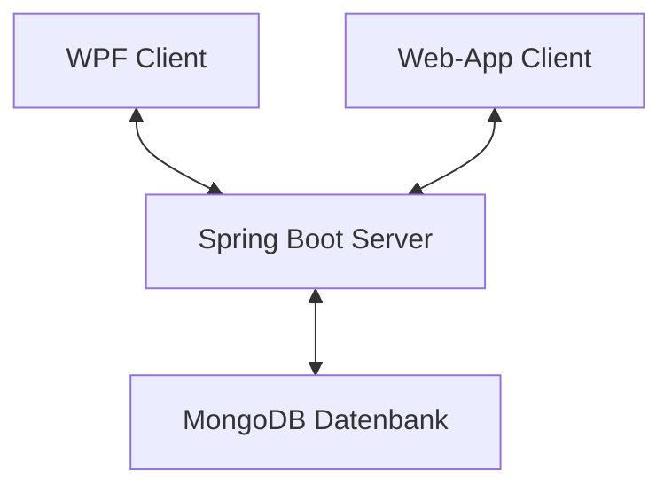

# Dokumentation Semesterprojekt Rautner

## Softwaredesign (Architektur)

Das Chat-Programm wurde in einer Client-Client-Server-Architektur entwicklet, wobei der Client als WPF-Anwendung oder WebApp implementiert ist und diese beide mit dem Server (welcher auf Spring Boot basiert) kommunizieren. Die Daten werden in einer MongoDB-Datenbank gespeichert.

## Beschreibung der Software

Das Chat-Programm (tinyWhatsApp) ermöglicht Benutzern miteinander in Echtzeit zu chatten. Es bietet eine benutzerfreundliche Oberfläche sowohl als Desktopanwendung (WPF) als auch als Webanwendung. Die Software überträgt die Daten natürlich verschlüsselt, sodass keiner Zugang zu den Benutzerdaten erhalten kann

## Endpoints

Der Spring-Boot Server basiert auf dem REST-Pinzip, dadurch ermöglicht er den Clients, Nachrichten zu senden, zu empfangen und vieles mehr. (Kein GET-Endpoint, da diese im Web keinen Body haben dürfen & ich mein System einheitlich halten wollte)
Die Endpunkte umfassen:

- `/tinyWhatsApp`: Genreller Endpoint der API
<br>
- `/checkUser`[POST]: Zugangsdaten des Benutzers überprüfen
- `/newUser`[POST]: Neuen Benutzer hinzufügen
- `/updateUser`[PUT]: Passwort des Benutzers aktualisieren
- `/deleteUser`[DELETE]: Benutzer löschen
<br>
- `/getChatNames`[POST]: Alle Chatnamen der Chats (in denen der Benutzer ist) erhalten
- `/newChat`[POST]: Neuen Chat anlegen
- `/updateChatName`[PUT]: Chatnamen aktualisieren
- `/deleteChat`[DELETE]: Chat löschen
<br>
- `/addUserToChat`[POST]: Benutzer zum Chat hinzufügen
- `/removeUserFromChat`[DELETE]: Benutzer aus dem Chat entfernen
<br>
- `/getMessages`[POST]: Alle Nachrichten eines Chats erhalten
- `/newMessage`[POST]: Neue Nachricht hinzufügen
- `/updateMessage`[PUT]: Nachrichtentext aktualisieren (nur in den ersten 5 Minuten nach erstellen der Nachricht möglich)
- `/deleteMessage`[DELETE]: Nachricht löschen

## Verwendung der API

Hier ist ein Beispiel für die Verwendung der API in einem Client (z.B. WPF):

```csharp
// Beispielcode für das Senden einer Nachricht
HttpClient client = new HttpClient();
var content = new StringContent("{ 'message': 'Hallo Welt!' }", Encoding.UTF8, "application/json");
var response = await client.PostAsync("https://example.com/messages", content);
```

## Digramme



````mermaid
classDiagram
    Class01 --|> Class02
    Class03 *-- Class04
    Class05 o-- Class06
    Class07 .. Class08
    Class09 --> C10
```
