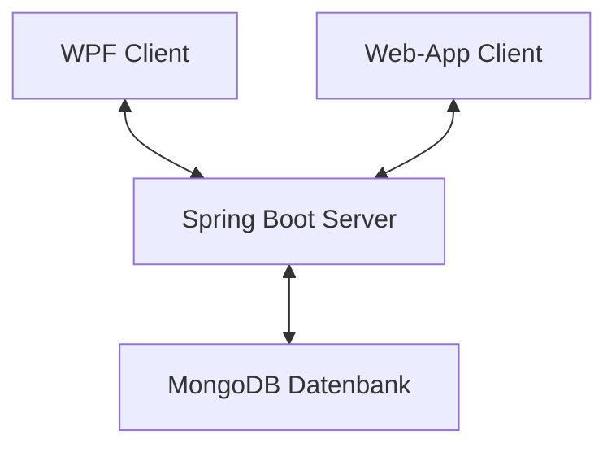

# Dokumentation Semesterprojekt Rautner

## Softwaredesign (Architektur)

Das Chat-Programm wurde in einer Client-Client-Server-Architektur entwicklet, wobei der Client als WPF-Anwendung oder WebApp implementiert ist und diese beide mit dem Server (welcher auf Spring Boot basiert) kommunizieren. Die Daten werden in einer MongoDB-Datenbank gespeichert.

## Beschreibung der Software

Das Chat-Programm (tinyWhatsApp) ermöglicht Benutzern miteinander in Echtzeit zu chatten. Es bietet eine benutzerfreundliche Oberfläche sowohl als Desktopanwendung (WPF) als auch als Webanwendung. Die Software überträgt die Daten natürlich verschlüsselt, sodass keiner Zugang zu den Benutzerdaten erhalten kann

## Endpoints

Der Spring-Boot Server basiert auf dem REST-Pinzip, dadurch ermöglicht er den Clients, Nachrichten zu senden, zu empfangen und vieles mehr. (Kein GET-Endpoint, da diese im Web keinen Body haben dürfen & ich mein System einheitlich halten wollte)
Die Endpunkte umfassen:

<!-- Genereller Endpoint -->
<details>
  <summary>/tinyWhatsApp []</summary>
  
  **Beschreibung:** Dieser Endpunkt ist der generelle Endpoint der API, welcher vor dem jeweiligen spezifischen Endpoint geschrieben werden muss.
</details>
<!-- Benutzer -->
<details>
  <summary>/checkUser [POST]</summary>
  
  **Beschreibung:** Dieser Endpunkt wird verwendet, um die Zugangsdaten eines Benutzers zu überprüfen.
  
  **JSON-Body:**
  ```json
  {
    "username": "Beispiel-Benutzername",
    "password": "Beispiel-Passwort"
  }
  ```
</details>
<details>
  <summary>/newUser [POST]</summary>
  
  **Beschreibung:** Dieser Endpoint wird verwendet, um einen Neuen Benutzer anzulegen.
  
  **JSON-Body:**
  ```json
  {
    "username": "Beispiel-Benutzername",
    "password": "Beispiel-Passwort"
  }
  ```
</details>
<details>
  <summary>/updateUser [PUT]</summary>
  
  **Beschreibung:** Dieser Endpoint wird verwedent, um das Passwort eines Benutzers zu ändern.
  
  **JSON-Body:**
  ```json
  {
    "username": "Beispiel-Benutzername",
    "password": "Beispiel-Passwort"
  }
  ```
</details>
<details>
  <summary>/deleteUser [DELETE]</summary>
  
  **Beschreibung:** Dieser Endpoint wird verwendet, um einen Benutzer zu löschen.
  
  **JSON-Body:**
  ```json
  {
    "username": "Beispiel-Benutzername",
    "password": "Beispiel-Passwort"
  }
  ```
</details>
<!-- Chat -->
<details>
  <summary>/getChatNames [POST]</summary>
  
  **Beschreibung:** Dieser Endpoint wirde verwendet, um die Namen aller Chats eines Benutzers zu erhalten.
  
  **JSON-Body:**
  ```json
  {
    "userID": "Beispiel-userID"
  }
  ```
</details>
<details>
  <summary>/newChat [POST]</summary>
  
  **Beschreibung:** Dieser Endpoint wirde verwendet, um einen neuen Chat anzulegen.
  
  **JSON-Body:**
  ```json
  {
    "userID": "Beispiel-userID",
    "chatName": "Beispiel-Chatnamen"
  }
  ```
</details>
<details>
  <summary>/updateChatName [PUT]</summary>
  
  **Beschreibung:** Dieser Endpoint wirde verwendet, um den Namen eines Chats zu aktualisieren.
  
  **JSON-Body:**
  ```json
  {
    "chatID": "Beispiel-chatID",
    "chatName": "Beispiel-Chatnamen"
  }
  ```
</details><details>
  <summary>/deleteChat [DELETE]</summary>
  
  **Beschreibung:** Dieser Endpoint wirde verwendet, um einen Chat zu löschen.
  
  **JSON-Body:**
  ```json
  {
    "chatID": "Beispiel-chatID"
  }
  ```
</details>
<!-- Benutzer & Chat -->
<details>
  <summary>/addUserToChat [POST]</summary>
  
  **Beschreibung:** Dieser Endpoint wirde verwendet, um einen Benutzer zu einem Chat hinzuzufügen.
  
  **JSON-Body:**
  ```json
  {
    "username": "Beispiel-Benutzername",
    "chatID": "Beispiel-chatID"
  }
  ```
</details>
<details>
  <summary>/removeUserFromChat [DELETE]</summary>
  
  **Beschreibung:** Dieser Endpoint wirde verwendet, um einen Benutzer aus einem Chat zu entfernen.
  
  **JSON-Body:**
  ```json
  {
    "username": "Beispiel-Benutzername",
    "chatID": "Beispiel-chatID"
  }
  ```
</details>
<!-- Nachrichten -->
<details>
  <summary>/getMessages [POST]</summary>
  
  **Beschreibung:** Dieser Endpoint wirde verwendet, um alle Nachrichten eines Chats zu erhalten.
  
  **JSON-Body:**
  ```json
  {
    "chatID": "Beispiel-chatID",
    "userID": "Beispiel-userID"
  }
  ```
</details>
<details>
  <summary>/newMessage [POST]</summary>
  
  **Beschreibung:** Dieser Endpoint wirde verwendet, um eine neue Nachricht zum Chat hinzuzufügen.
  
  **JSON-Body:**
  ```json
  {
    "userID": "Beispiel-userID",
    "chatID": "Beispiel-chatID",
    "message": "Beispiel-Nachrichtentext"
  }
  ```
</details>
<details>
  <summary>/updateMessage [PUT]</summary>
  
  **Beschreibung:** Dieser Endpoint wirde verwendet, um den Inhalt einer Nachricht zu aktualisieren (geht nur in den ersten 5 Minuten nch erstellen der Nachricht).
  
  **JSON-Body:**
  ```json
  {
    "userID": "Beispiel-userID",
    "chatID": "Beispiel-chatID",
    "messageID": "Beispiel-messageID",
    "message": "Beispiel-Nachrichtentext"
  }
  ```
</details>
<details>
  <summary>/deleteMessage [DELETE]</summary>
  
  **Beschreibung:** Dieser Endpoint wirde verwendet, um eine Nachricht aus einem Chat zu löschen.
  
  **JSON-Body:**
  ```json
  {
    "userID": "Beispiel-userID",
    "chatID": "Beispiel-chatID",
    "messageID": "Beispiel-messageID"
  }
  ```
</details>

## Verwendung der API

Hier ist ein Beispiel für die Verwendung der API in einem Client (z.B. WPF):

```csharp
// Beispielcode für das Senden einer Nachricht
HttpClient client = new HttpClient();
var content = new StringContent("{ 'message': 'Hallo Welt!' }", Encoding.UTF8, "application/json");
var response = await client.PostAsync("https://example.com/messages", content);
```

## Digramme



````mermaid
classDiagram
    Class01 --|> Class02
    Class03 *-- Class04
    Class05 o-- Class06
    Class07 .. Class08
    Class09 --> C10
```
