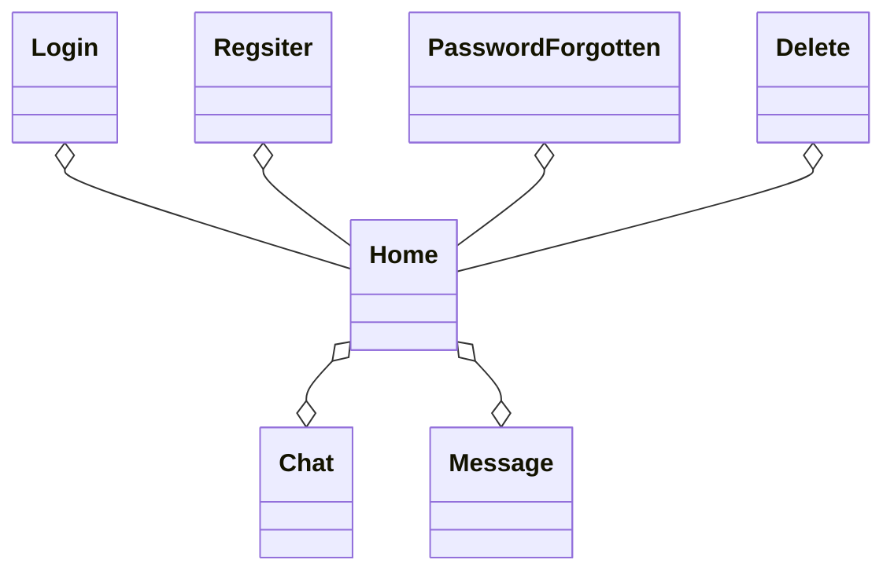
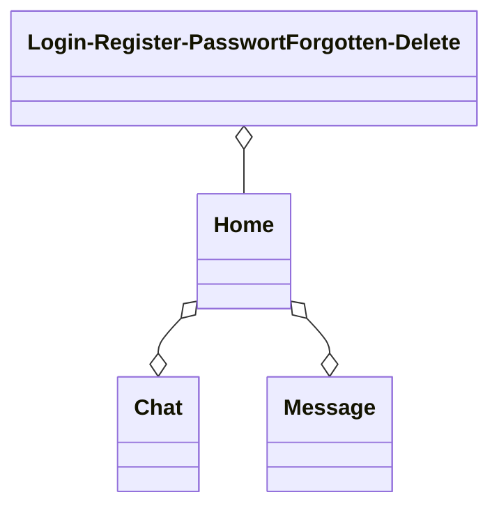
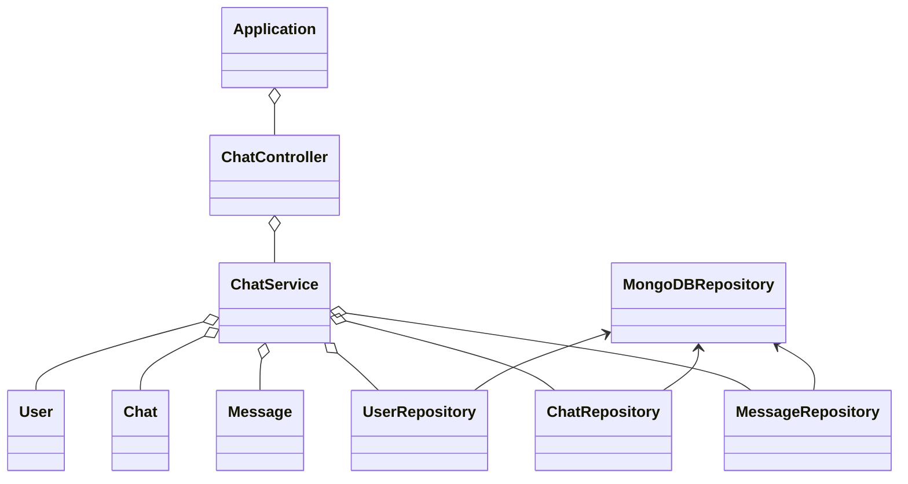

# Dokumentation Semesterprojekt Rautner

## Softwaredesign (Architektur)

Das Chat-Programm wurde in einer Client-Client-Server-Architektur entwicklet, wobei der Client als WPF-Anwendung oder WebApp implementiert ist und diese beide mit dem Server (welcher auf Spring Boot basiert) kommunizieren. Die Daten werden in einer MongoDB-Datenbank gespeichert.

## Beschreibung der Software

Das Chat-Programm (tinyWhatsApp) ermöglicht es Benutzern miteinander in Echtzeit zu chatten. Es bietet eine benutzerfreundliche Oberfläche sowohl als Desktopanwendung (WPF) als auch als Webanwendung. Die Software überträgt die Daten natürlich verschlüsselt, sodass keiner Zugang zu den Benutzerdaten erhalten kann

##  API-Beschreibung

Der Spring-Boot Server basiert auf dem REST-Pinzip, dadurch ermöglicht er den Clients, Nachrichten zu senden, zu empfangen und vieles mehr. (Kein GET-Endpoint, da diese im Web keinen Body haben dürfen & ich mein System einheitlich halten wollte)
### Die Endpunkte umfassen:

<!-- Genereller Endpoint -->
<details>
  <summary>/tinyWhatsApp []</summary>
  
  **Beschreibung:** Dieser Endpunkt ist der generelle Endpoint der API, welcher vor dem jeweiligen spezifischen Endpoint geschrieben werden muss.
</details>
<!-- Benutzer -->
<details>
  <summary>/checkUser [POST]</summary>
  
  **Beschreibung:** Dieser Endpunkt wird verwendet, um die Zugangsdaten eines Benutzers zu überprüfen.
  
  **JSON-Body:**
  ```json
  {
    "username": "Beispiel-Benutzername",
    "password": "Beispiel-Passwort"
  }
  ```
</details>
<details>
  <summary>/newUser [POST]</summary>
  
  **Beschreibung:** Dieser Endpoint wird verwendet, um einen Neuen Benutzer anzulegen.
  
  **JSON-Body:**
  ```json
  {
    "username": "Beispiel-Benutzername",
    "password": "Beispiel-Passwort"
  }
  ```
</details>
<details>
  <summary>/updateUser [PUT]</summary>
  
  **Beschreibung:** Dieser Endpoint wird verwedent, um das Passwort eines Benutzers zu ändern.
  
  **JSON-Body:**
  ```json
  {
    "username": "Beispiel-Benutzername",
    "password": "Beispiel-Passwort"
  }
  ```
</details>
<details>
  <summary>/deleteUser [DELETE]</summary>
  
  **Beschreibung:** Dieser Endpoint wird verwendet, um einen Benutzer zu löschen.
  
  **JSON-Body:**
  ```json
  {
    "username": "Beispiel-Benutzername",
    "password": "Beispiel-Passwort"
  }
  ```
</details>
<!-- Chat -->
<details>
  <summary>/getChatNames [POST]</summary>
  
  **Beschreibung:** Dieser Endpoint wirde verwendet, um die Namen aller Chats eines Benutzers zu erhalten.
  
  **JSON-Body:**
  ```json
  {
    "userID": "Beispiel-userID"
  }
  ```
</details>
<details>
  <summary>/newChat [POST]</summary>
  
  **Beschreibung:** Dieser Endpoint wirde verwendet, um einen neuen Chat anzulegen.
  
  **JSON-Body:**
  ```json
  {
    "userID": "Beispiel-userID",
    "chatName": "Beispiel-Chatnamen"
  }
  ```
</details>
<details>
  <summary>/updateChatName [PUT]</summary>
  
  **Beschreibung:** Dieser Endpoint wirde verwendet, um den Namen eines Chats zu aktualisieren.
  
  **JSON-Body:**
  ```json
  {
    "chatID": "Beispiel-chatID",
    "chatName": "Beispiel-Chatnamen"
  }
  ```
</details><details>
  <summary>/deleteChat [DELETE]</summary>
  
  **Beschreibung:** Dieser Endpoint wirde verwendet, um einen Chat zu löschen.
  
  **JSON-Body:**
  ```json
  {
    "chatID": "Beispiel-chatID"
  }
  ```
</details>
<!-- Benutzer & Chat -->
<details>
  <summary>/addUserToChat [POST]</summary>
  
  **Beschreibung:** Dieser Endpoint wirde verwendet, um einen Benutzer zu einem Chat hinzuzufügen.
  
  **JSON-Body:**
  ```json
  {
    "username": "Beispiel-Benutzername",
    "chatID": "Beispiel-chatID"
  }
  ```
</details>
<details>
  <summary>/removeUserFromChat [DELETE]</summary>
  
  **Beschreibung:** Dieser Endpoint wirde verwendet, um einen Benutzer aus einem Chat zu entfernen.
  
  **JSON-Body:**
  ```json
  {
    "username": "Beispiel-Benutzername",
    "chatID": "Beispiel-chatID"
  }
  ```
</details>
<!-- Nachrichten -->
<details>
  <summary>/getMessages [POST]</summary>
  
  **Beschreibung:** Dieser Endpoint wirde verwendet, um alle Nachrichten eines Chats zu erhalten.
  
  **JSON-Body:**
  ```json
  {
    "chatID": "Beispiel-chatID",
    "userID": "Beispiel-userID"
  }
  ```
</details>
<details>
  <summary>/newMessage [POST]</summary>
  
  **Beschreibung:** Dieser Endpoint wirde verwendet, um eine neue Nachricht zum Chat hinzuzufügen.
  
  **JSON-Body:**
  ```json
  {
    "userID": "Beispiel-userID",
    "chatID": "Beispiel-chatID",
    "message": "Beispiel-Nachrichtentext"
  }
  ```
</details>
<details>
  <summary>/updateMessage [PUT]</summary>
  
  **Beschreibung:** Dieser Endpoint wirde verwendet, um den Inhalt einer Nachricht zu aktualisieren (geht nur in den ersten 5 Minuten nch erstellen der Nachricht).
  
  **JSON-Body:**
  ```json
  {
    "userID": "Beispiel-userID",
    "chatID": "Beispiel-chatID",
    "messageID": "Beispiel-messageID",
    "message": "Beispiel-Nachrichtentext"
  }
  ```
</details>
<details>
  <summary>/deleteMessage [DELETE]</summary>
  
  **Beschreibung:** Dieser Endpoint wirde verwendet, um eine Nachricht aus einem Chat zu löschen.
  
  **JSON-Body:**
  ```json
  {
    "userID": "Beispiel-userID",
    "chatID": "Beispiel-chatID",
    "messageID": "Beispiel-messageID"
  }
  ```
</details>

## Verwendung der API

Unterhalb sind Codeblöcke, die das Login meines ChatProgramms darstellen

<details>
  <Summary>Spring-Boot Server</summary>

  **Beschreibung:** Login von dem Spring-Boot Server aus

  **Java-Endpoint:**
  ```java
    @PostMapping("/checkUser")
    public String checkUser(@RequestBody String body) {
        JSONObject jsonBody = new JSONObject(body);
        return chatService.checkUser(jsonBody.getString("username"), jsonBody.getString("password"));
    }
  ```

  **Java-Backend:**
  ```java
    //UserID aus MongoDB erhalten
    public String checkUser(String username, String password) {
        User user = userRepository.findUserByUsernameAndPassword(username, this.encrypt(password));
        if (user != null) {
            return user.getUserID();
        }
        return null;
    }
  ```
</details>

<details>
  <Summary>WPF-Client</summary>

  **Beschreibung:** Login von dem WPF-Client aus

  **C#-Code:**
  ```csharp
    //Benutzerdaten überprüfen
    async public Task<string?> Login(string name, string passwort)
    {
      try
      {
        //Username & Passwort an den Server schicken
        RestRequest request = new RestRequest("/checkUser", Method.Post);
        var body = new
        {
          username = name,
          password = this.Hash(passwort)
        };
        request.AddJsonBody(body);

        //Antwort (userID oder "" erhalten)
        RestResponse? response = await client.ExecuteAsync(request);
        return response.Content;
      }
      catch (Exception ex)
      {
        //MessageBox zum Anzeigen der Error-Message
        MessageBox.Show(ex.Message);
      }
      return null;
    }
  ```
</details>

<details>
  <Summary>WebApp-Client</summary>

  **Beschreibung:** Login von dem WebApp-Client aus

  **JS-Code:**
 ```js
    //Benutzerdaten überprüfen
    async function checkUserExistence(event) {
      try {
        event.preventDefault();
        //Benutzername & Passwort erhalten
        const username = document.getElementById("usernameLogin").value;
        const password = document.getElementById("passwordLogin").value;

        //Überprüfen, ob die Url zum Server in localStorage gesetzt wurde
        if (localStorage.getItem('urlToSpringBootServer') !== null && localStorage.getItem('urlToSpringBootServer') !== "") {
          //Überprpfen, ob Benutzername & Passwort richtig eingegeben wurde
          if (username !== null && username !== "" && password !== null && password !== "") {
            //Anfrage an den Server senden
            const response = await fetch(`${localStorage.getItem('urlToSpringBootServer')}/checkUser`, {
              method: 'POST', body: JSON.stringify({
              'username': username, 'password': await hash(password)
              })
            });

            //Login-Form leeren
            document.getElementById("usernameLogin").value = "";
            document.getElementById("passwordLogin").value = "";

            //Antwort erhalten
            const data = await response.text();
            //Wenn userID und nicht "" erhalten, dann weiter zu Home
            if (data !== null && data !== "") {
              localStorage.setItem('userID', data);
              localStorage.setItem('webAppStatus', "active");
              window.location.href = '../home/home.html' + localStorage.  getItem('urlParameter');
            } else {
              //Anzeigen, dass Anmeldedaten falsch waren
              alert("Anmeldung fehlgeschlagen");
            }
          } else {
            //Anzeigen, dass Benutzername und/oder Passwort nicht eingegeben wurde
            alert("Bitte geben Sie einen Benutzernamen und Passwort ein");
          }
        } else {
          //Anzeigen, dass der Server nicht erreicht werden aknn (weil die Url fehlt)
          alert("Server konnte nicht erreicht werden");
        }
      } catch (error) {
        //Error in Console loggen
       console.error(error);
      }
    }
  ```
</details>

## Diskussion der Ergebnisse
Nach ca. 2 Monaten Entwicklung stelle ist die Erste Version meine ChatProgramms (tinyWhatsApp) vor. Das Chatprogramm hat eine intuative Benutzeroberfläche und eine Echtzeitkommunikation. Durch die Entwicklung der Clients in verschidenen Technologien (WPF & WebApp) ist die Unterstützung für sämtliche Platformen gegeben. Die Daten werden sicher in einer MongoDB-Datenbank gespeichert. Das Passwort wird im jeweiligen Client gehashed und im Server nochmals mit AES verschlüsselt. Durch die Verschlüsselte Übertragung sind die Benutzerdaten von Fremdzugriffen gesichert.

### Zusammenfassung
tinyWhatsApp stellt eine intuitive Benutzeroberfläche für sämtliche Platformen zur Verfügung. Die REST-API des Spring-Boot Servers ermöglicht die Echtzeitkommunikation zwischen den Clients und der Datenbank.

### Hintergründe
Bei der Entwicklung der Chatprogramms wurde der Fokus auf Sicherheit der Benutzerdaten und Benutzerfreundlichkeit gelegt. Durch die Verwendung aktueller Technologien wie Spring-Boot, WPF, HTML, CSS, JSON & JavaScript wird die zukünftige Unterstützung gewährleistet. Die Nutzung einer MongoDB-Datenbank sorgt ebenfalls für die sichere Speicherung der Daten & effiziente Datenverwaltung.

### Ausblicke
In Zukunft soll das Chatprogramm auch Dateienübertragung (Foto, Video & Audio) unterstützen. Ebenfalls soll ein Benachrichtigungssystem implementiert werden. Durch Einbeziehen des Benutzerfeedbacks wird die Benutzerfreundlichkeit ebenfalls stark erhöht werden. TinyWhatsApp soll in Zukunft eine führende Plattform für sichere und benutzerfreundliche Echtzeitkommunikation werden.

## Diagramme

### Konfiguration zwischen den Clients, dem Server & der Datenbank


### Klassendiagramm des WPF-Clients


### Klassendiagramm des WebApp-Clients


### Klassendiagramm des Spring-Boot Servers


### Use-Cases Diagramm


## Quellenverzeichnis

### Spring-Boot Server
#### [Spring-Boot]()
#### [JSON](https://www.json.org/json-en.html)

### WPF-Client
#### [C#](https://learn.microsoft.com/de-de/dotnet/csharp/)
#### [JSON](https://www.json.org/json-en.html)

### WebApp-Client
#### [HTML](https://developer.mozilla.org/en-US/docs/Web/HTML)
#### [CSS](https://developer.mozilla.org/en-US/docs/Web/CSS)
#### [JavaScript](https://developer.mozilla.org/en-US/docs/Web/JavaScript)
#### [JSON](https://www.json.org/json-en.html)

### MongoDB Datenbank
#### [MongoDB](https://www.mongodb.com/docs/)