# Dokumentation Semesterprojekt Rautner

## Softwaredesign (Architektur)

Das Chat-Programm wurde in einer Client-Client-Server-Architektur entwicklet, wobei der Client als WPF-Anwendung oder WebApp implementiert ist und diese beide mit dem Server (welcher auf Spring Boot basiert) kommunizieren. Die Daten werden in einer MongoDB-Datenbank gespeichert.

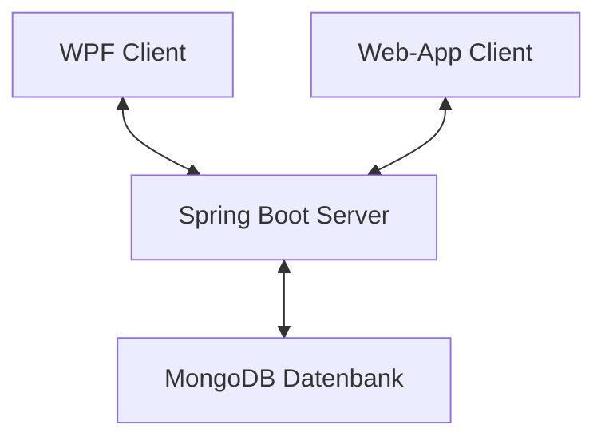

## Beschreibung der Software

Das Chat-Programm (tinyWhatsApp) ermöglicht es Benutzern miteinander in Echtzeit zu chatten. Es bietet eine benutzerfreundliche Oberfläche sowohl als Desktopanwendung (WPF) als auch als Webanwendung. Die Software überträgt die Daten natürlich verschlüsselt, sodass keiner Zugang zu den Benutzerdaten erhalten kann

## Funktionen der WebApp

### Login
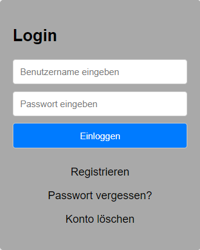
In dem Eingabefeld mit dem Placeholder-Text **"Benutzername eingeben"** gibt man den Benutzernamemn des zu verwendeten Benutzers ein
In dem Eingabefeld mit dem Placeholder-Text **"Passwort eingeben"** gibt man das Passwort des zu verwendeten Benutzers ein
Wenn man auf den **Registrieren** Knopf drückt, dann wird man zum Registrieren-Fenster weitergeleitet
Wenn man auf den **Passwort vergessen?** Knopf drückt, dann wird man zum PasswortForgotten-Fenster weitergeleitet
Wenn man auf den **Konto löschen** Knopf drückt, dann wird man zum BenutzerLöschen-Fenster weitergeleitet
Wenn man in dem Passwort-Feld auf **'Enter'** drükt, dann wird überprüft, ob der Benutzerexistiert

### Registrieren
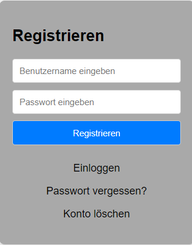
In dem Eingabefeld mit dem Placeholder-Text **"Benutzername eingeben"** gibt man den Benutzernamemn des zu erstellenden Benutzers ein
In dem Eingabefeld mit dem Placeholder-Text **"Passwort eingeben"** gibt man das Passwort des zu erstellenden Benutzers ein
Wenn man auf den **Einloggen** Knopf drückt, dann wird man zum Einloggen-Fenster weitergeleitet
Wenn man auf den **Passwort vergessen?** Knopf drückt, dann wird man zum PasswortForgotten-Fenster weitergeleitet
Wenn man auf den **Konto löschen** Knopf drückt, dann wird man zum BenutzerLöschen-Fenster weitergeleitet
Wenn man in dem Passwort-Feld auf **'Enter'** drückt, dann wird überprüft, ob noch kein Benutzer mit diesem Namen existiert

### Passwort vergessen
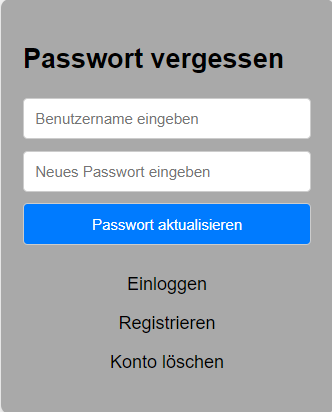
In dem Eingabefeld mit dem Placeholder-Text **"Benutzername eingeben"** gibt man den Benutzernamemn des zu aktualisierenden Benutzers ein
In dem Eingabefeld mit dem Placeholder-Text **"Passwort eingeben"** gibt man das Passwort des zu aktualisierenden Benutzers ein
Wenn man auf den **Einloggen** Knopf drückt, dann wird man zum Login-Fenster weitergeleitet
Wenn man auf den **Registrieren** Knopf drückt, dann wird man zum Registrieren-Fenster weitergeleitet
Wenn man auf den **Konto löschen** Knopf drückt, dann wird man zum BenutzerLöschen-Fenster weitergeleitet
Wenn man in dem Passwort-Feld auf **'Enter'** drückt, dann wird überprüft, ob ein Benutzer mit diesem Namen existiert

### Konto löschen
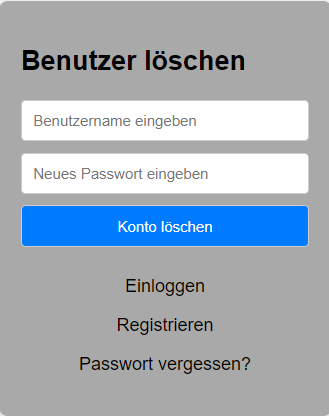
In dem Eingabefeld mit dem Placeholder-Text **"Benutzername eingeben"** gibt man den Benutzernamemn des zu löschenden Benutzers ein
In dem Eingabefeld mit dem Placeholder-Text **"Passwort eingeben"** gibt man das Passwort des zu löschenden Benutzers ein
Wenn man auf den **Einloggen** Knopf drückt, dann wird man zum Login-Fenster weitergeleitet
Wenn man auf den **Registrieren** Knopf drückt, dann wird man zum Registrieren-Fenster weitergeleitet
Wenn man auf den **Passwort vergessen?** Knopf drückt, dann wird man zum PasswortForgotten-Fenster weitergeleitet
Wenn man in dem Passwort-Feld auf **'Enter'** drückt, dann wird überprüft, ob der Benutzer existiert

### Hauptfenster
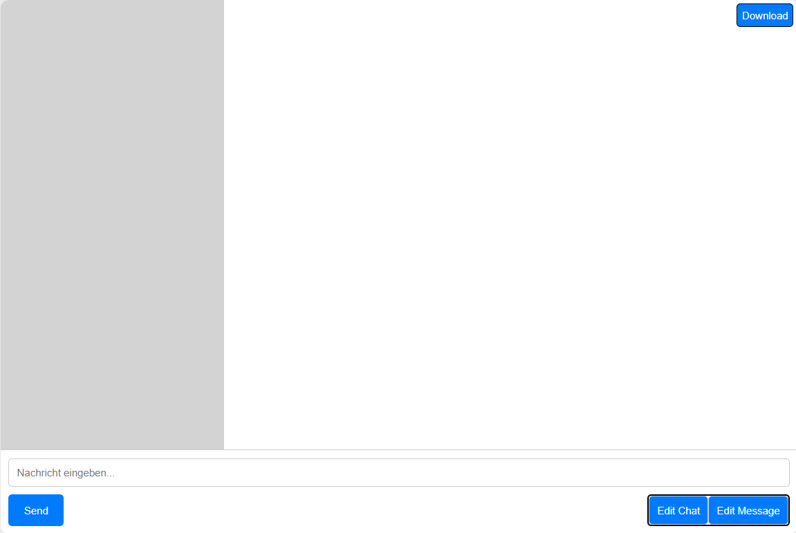
#### Chatnamen-Frontend
In dem Grauen Balken (links) werden alle Chatnamen angezeigt
Wenn auf einen Chatnamen doppelt gedrückt wird, dann wird das Chat-Feld geöffnet
Ebenfalls kann man zum Öffnen des Chat-Feldes den **Edit Chat** Knopf rechts unten drücken
#### Nachrichten-Frontend
In dem Weißen Balken (rechts) werden alle Nachrichten des aktuellen Chats angezeigt
Wenn auf eine Nachricht doppelt gedrückt wird, dann wird das Message-Feld geöffnet
Ebenfalls kann man zum Öffnen des **Edit Message** Knopf rechts unten drücken
#### Senden-Frontend
In dem Eingabefeld unten mit dem Placeholder-Text **"Nachricht eingeben"** gibt man den Text für neue Nachrichten ein
Wenn man in diesem Feld auf **'Enter'** drückt, dann wird die Nachricht gesendet
Ebenfalls kann man zum Absenden des Text den **Send** Knopf links unten drücken
#### Download-Knopf
Wenn der **Download** Knopf rechts oben gedrückt wird, dann wird die WebApp als Lokales Programm instaliert
#### Laden eines neuen Chats
Wenn man einmal auf einen Chatnamen drückt, dann wird der Inhalt des Chats rechts in das Nachrichten-Feld eingefügt

### Chatfeld
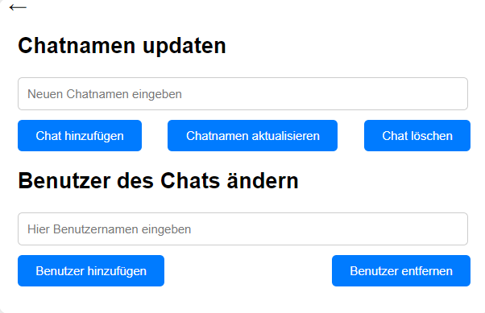
#### Chat
In dem Eingabefeld mit dem Placeholder-Text **"Neuen Chatnamen eingeben"** gibt man den Chatnamen ein
Wenn man auf den **Chat hinzufügen** Knopf drückt, dann wird ein neuer Chat erstellt
Wenn man auf den **Chatnamen aktualisieren** Knopf drückt, dann wird der Namen des aktuellen Chats geändert
Wenn man auf den **Chat löschen** Knopf drückt, dann wird der aktuelle Chat gelöscht
#### Benutzer
In dem Eingabefeld mit dem Placeholder-Text **"Hier Benutzernamen eingeben"** gibt man einen Benutzernamen eines anderen Benutzers ein
Wenn man auf den **Benutzer hinzufügen** Knopf drückt, dann kann man einen anderen Benutzer zum aktuellen Chat hinzufügen
Wenn man auf den **Benutzer entfernen** Knopf drückt, dann kann man einen anderen Benutzer des aktuellen Chats entfernen

### Messagefeld
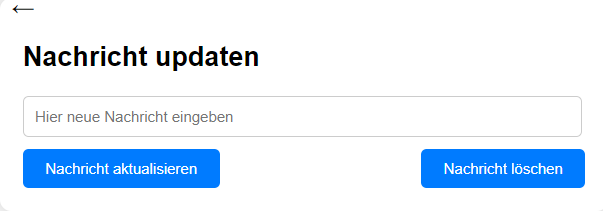
In dem Eingabefeld mit dem Placeholder-text **"Hier neue Nachricht eingeben"** gibt man den neuen Inhalt der Nachricht ein
Wenn man auf den **Nachricht aktualisieren** Knopf drückt, dann wird der Inhalt der Nachricht aktualisiert (ist nur in den ersten 5 Minuten nach Erstellen der Nachricht möglich)
Wenn man auf den **Nachricht löschen** Knopf drückt, dann wird die aktuelle Nachricht gelöscht

## Funktionen der WPF

### Login
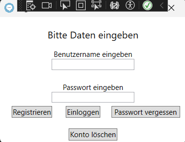
In dem Eingabefeld unter dem Label **"Benutzername eingeben"** gibt man den Benutzernamemn des zu verwendeten Benutzers ein
In dem Eingabefeld unter dem Label **"Passwort eingeben"** gibt man das Passwort des zu verwendeten Benutzers ein
Wenn man auf den **Registrieren** Knopf drückt, dann wird man zum Registrieren-Fenster weitergeleitet
Wenn man auf den **Passwort vergessen** Knopf drückt, dann wird man zum PasswortForgotten-Fenster weitergeleitet
Wenn man auf den **Konto löschen** Knopf drückt, dann wird man zum BenutzerLöschen-Fenster weitergeleitet
Wenn man in dem Passwort-Feld auf **'Enter'** drückt, dann wird überprüft, ob der Benutzer existiert

### Registrieren
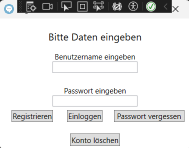
In dem Eingabefeld unter dem Label **"Benutzername eingeben"** gibt man den Benutzernamemn des zu erstellenden Benutzers ein
In dem Eingabefeld unter dem Label **"Passwort eingeben"** gibt man das Passwort des zu erstellenden Benutzers ein
Wenn man auf den **Einloggen** Knopf drückt, dann wird man zum Einloggen-Fenster weitergeleitet
Wenn man auf den **Passwort vergessen** Knopf drückt, dann wird man zum PasswortForgotten-Fenster weitergeleitet
Wenn man auf den **Konto löschen** Knopf drückt, dann wird man zum BenutzerLöschvben-Fenster weitergeleitet
Wenn man in dem Passwort-Feld auf **'Enter'** drückt, dann wird überprüft, ob noch kein Benutzer mit dem Namen existiert

### Passwort vergessen
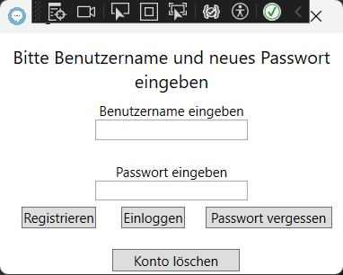
In dem Eingabefeld unter dem Label **"Benutzername eingeben"** gibt man den Benutzernamemn des zu aktualisierenden Benutzers ein
In dem Eingabefeld unter dem Label **"Passwort eingeben"** gibt man das Passwort des zu aktualisierenden Benutzers ein
Wenn man auf den **Einloggen** Knopf drückt, dann wird man zum Login-Fenster weitergeleitet
Wenn man auf den **Registrieren** Knopf drückt, dann wird man zum Registrieren-Fenster weitergeleitet
Wenn man auf den **Konto löschen** Knopf drückt, dann wird man zum BenutzerLöschen-Fenster weitergeleitet
Wenn man in dem Passwort-Feld auf **'Enter'** drückt, dann wird überprüft, ob ein Benutzer mit diesem Namen exisitert

### Konto löschen
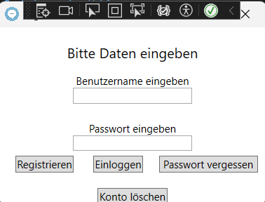
In dem Eingabefeld unter dem Label **"Benutzername eingeben"** gibt man den Benutzernamemn des zu löschenden Benutzers ein
In dem Eingabefeld unter dem Label **"Passwort eingeben"** gibt man das Passwort des zu löschenden Benutzers ein
Wenn man auf den **Einloggen** Knopf drückt, dann wird man zum Login-Fenster weitergeleitet
Wenn man auf den **Registrieren** Knopf drückt, dann wird man zum Registrieren-Fenster weitergeleitet
Wenn man auf den **Passwort vergessen** Knopf drückt, dann wird man zum PasswortForgotten-Fenster weitergeleitet
Wenn man in dem Passwort-Feld auf **'Enter'** drückt, dann wird überprüft, ob der Benutzer existiert

### Hauptfenster
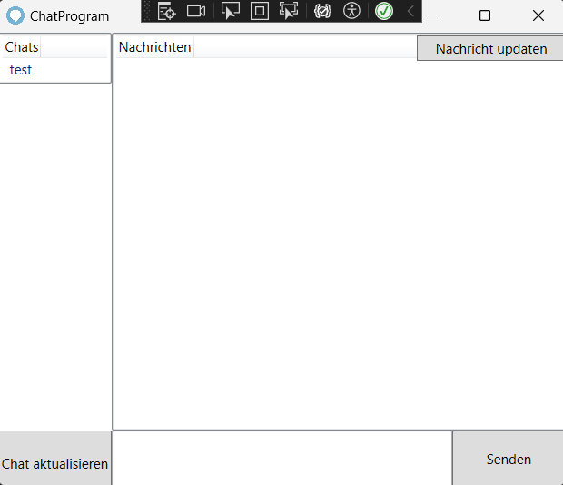
#### Chatnamen-Frontend
In dem linken Balken werden alle Chatnamen angezeigt
Wenn auf einen Chatnamen doppelt gedrückt wird, dann wird das Chat-Feld geöffnet
Ebenfalls kann man zum Öffnen des Chat-Feldes den **Chat aktualisieren** Knopf links unten drücken
#### Nachrichten-Frontend
In dem rechten Balken werden alle Nachrichten des aktuellen Chats angezeigt
Wenn auf eine Nachricht doppelt gedrückt wird, dann wird das Message-Feld geöffnet
Ebenfalls kann man zum Öffnen des **Nachrichten updaten** Knopf rechts obem drücken
#### Senden-Frontend
In dem Eingabefeld unten mitte, gibt man den Text für neue Nachrichten ein
Wenn man in diesem Feld auf **'Enter'** drückt, dann wird die Nachricht gesendet
Ebenfalls kann man zum Absenden des Text den **Senden** Knopf rechts unten drücken
#### Laden eines neuen Chats
Wenn man einmal auf einen Chatnamen drückt, dann wird der Inhalt des Chats rechts in das Nachrichten-Feld eingefügt

### Chatfeld
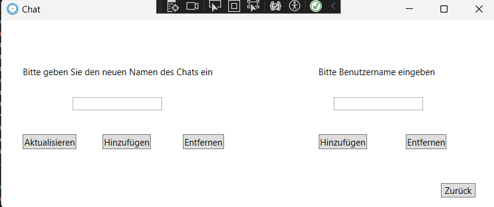
#### Chat
In dem Eingabefeld unter dem Label **"Bitte geben Sie den neuen Namen des Chats ein"** gibt man den Chatnamen ein
Wenn man auf den linken **Hinzufügen** Knopf drückt, dann wird ein neuer Chat erstellt
Wenn man auf den **Aktualisieren** Knopf drückt, dann wird der Namen des aktuellen Chats geändert
Wenn man auf den linken **Entfernen** Knopf drückt, dann wird der aktuelle Chat gelöscht
#### Benutzer
In dem Eingabefeld unter dem Label **"Bitte Benutzernamen eingeben"** gibt man einen Benutzernamen eines anderen Benutzers ein
Wenn man auf den rechten **Hinzufügen** Knopf drückt, dann kann man einen anderen Benutzer zum aktuellen Chat hinzufügen
Wenn man auf den rechten **BEntfernen** Knopf drückt, dann kann man einen anderen Benutzer des aktuellen Chats entfernen

### Messagefeld
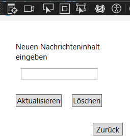
In dem Eingabefeld unter dem Label **"Neuen Nachrichteninhalt eingeben"** gibt man den neuen Inhalt der Nachricht ein
Wenn man auf den **Aktualisieren** Knopf drückt, dann wird der Inhalt der Nachricht aktualisiert (ist nur in den ersten 5 Minuten nach Erstellen der Nachricht möglich)
Wenn man auf den **Löschen** Knopf drückt, dann wird die aktuelle Nachricht gelöscht

##  API-Beschreibung

Der Spring-Boot Server basiert auf dem REST-Pinzip, dadurch ermöglicht er den Clients, Nachrichten zu senden, zu empfangen und vieles mehr. (Keine GET-Endpoints, da ich für die Datenübertragung von den Clients an den Server immer den Body verwende & dieses im Web aufgrund von Sicherheitsstandards gesperrt ist)

### Die Endpunkte umfassen:

<!-- Genereller Endpoint -->
<details>
  <summary>/tinyWhatsApp []</summary>
  
  **Beschreibung:** Dieser Endpunkt ist der generelle Endpoint der API, welcher vor dem jeweiligen spezifischen Endpoint geschrieben werden muss.
</details>
<!-- Benutzer -->
<details>
  <summary>/checkUser [POST]</summary>
  
  **Beschreibung:** Dieser Endpunkt wird verwendet, um die Zugangsdaten eines Benutzers zu überprüfen.
  
  **JSON-Body:**
  ```json
  {
    "username": "Beispiel-Benutzername",
    "password": "Beispiel-Passwort"
  }
  ```

  **Return-Wert:**
  ```json
  {
    "userID": "Beispiel-UserID"
  }
  ```
</details>
<details>
  <summary>/newUser [POST]</summary>
  
  **Beschreibung:** Dieser Endpoint wird verwendet, um einen Neuen Benutzer anzulegen.
  
  **JSON-Body:**
  ```json
  {
    "username": "Beispiel-Benutzername",
    "password": "Beispiel-Passwort"
  }
  ```

  **Return-Wert:**
  ```json
  {
    "userID": "Beispiel-UserID"
  }
  ```
</details>
<details>
  <summary>/updateUser [PUT]</summary>
  
  **Beschreibung:** Dieser Endpoint wird verwedent, um das Passwort eines Benutzers zu ändern.
  
  **JSON-Body:**
  ```json
  {
    "username": "Beispiel-Benutzername",
    "password": "Beispiel-Passwort"
  }
  ```

  **Return-Wert:**
  ```json
  {
    "userID": "Beispiel-UserID"
  }
  ```
</details>
<details>
  <summary>/deleteUser [DELETE]</summary>
  
  **Beschreibung:** Dieser Endpoint wird verwendet, um einen Benutzer zu löschen.
  
  **JSON-Body:**
  ```json
  {
    "username": "Beispiel-Benutzername",
    "password": "Beispiel-Passwort"
  }
  ```

  **Return-Wert:**
  ###### Entweder:
  ```text
    "true"
  ```
  ###### Oder:
  ```text
    "false"
  ```
</details>
<!-- Chat -->
<details>
  <summary>/getChatNames [POST]</summary>
  
  **Beschreibung:** Dieser Endpoint wurde verwendet, um die Namen aller Chats eines Benutzers zu erhalten.
  
  **JSON-Body:**
  ```json
  {
    "userID": "Beispiel-userID"
  }
  ```

  **Return-Wert:**
  ```json
  {
    "chatID": "Beispiel-ChatID",
    "chatName ": "Beispiel-ChatName"
  }
  ```
</details>
<details>
  <summary>/newChat [POST]</summary>
  
  **Beschreibung:** Dieser Endpoint wurde verwendet, um einen neuen Chat anzulegen.
  
  **JSON-Body:**
  ```json
  {
    "userID": "Beispiel-userID",
    "chatName": "Beispiel-Chatnamen"
  }
  ```

  **Return-Wert:**
  ###### Entweder:
  ```text
    "true"
  ```
  ###### Oder:
  ```text
    "false"
  ```
</details>
<details>
  <summary>/updateChatName [PUT]</summary>
  
  **Beschreibung:** Dieser Endpoint wurde verwendet, um den Namen eines Chats zu aktualisieren.
  
  **JSON-Body:**
  ```json
  {
    "chatID": "Beispiel-chatID",
    "chatName": "Beispiel-Chatnamen"
  }
  ```

  **Return-Wert:**
  ###### Entweder:
  ```text
    "true"
  ```
  ###### Oder:
  ```text
    "false"
  ```
</details><details>
  <summary>/deleteChat [DELETE]</summary>
  
  **Beschreibung:** Dieser Endpoint wurde verwendet, um einen Chat zu löschen.
  
  **JSON-Body:**
  ```json
  {
    "chatID": "Beispiel-chatID"
  }
  ```

  **Return-Wert:**
  ###### Entweder:
  ```text
    "true"
  ```
  ###### Oder:
  ```text
    "false"
  ```
</details>
<!-- Benutzer & Chat -->
<details>
  <summary>/addUserToChat [POST]</summary>
  
  **Beschreibung:** Dieser Endpoint wurde verwendet, um einen Benutzer zu einem Chat hinzuzufügen.
  
  **JSON-Body:**
  ```json
  {
    "username": "Beispiel-Benutzername",
    "chatID": "Beispiel-chatID"
  }
  ```

  **Return-Wert:**
  ###### Entweder:
  ```text
    "true"
  ```
  ###### Oder:
  ```text
    "false"
  ```
</details>
<details>
  <summary>/removeUserFromChat [DELETE]</summary>
  
  **Beschreibung:** Dieser Endpoint wurde verwendet, um einen Benutzer aus einem Chat zu entfernen.
  
  **JSON-Body:**
  ```json
  {
    "username": "Beispiel-Benutzername",
    "chatID": "Beispiel-chatID"
  }
  ```

  **Return-Wert:**
  ###### Entweder:
  ```text
    "true"
  ```
  ###### Oder:
  ```text
    "false"
  ```
</details>
<!-- Nachrichten -->
<details>
  <summary>/getMessages [POST]</summary>
  
  **Beschreibung:** Dieser Endpoint wurde verwendet, um alle Nachrichten eines Chats zu erhalten.
  
  **JSON-Body:**
  ```json
  {
    "chatID": "Beispiel-chatID",
    "userID": "Beispiel-userID"
  }
  ```

  **Return-Wert:**
  ###### Entweder:
  ```json
  {
    "messageID" : "Beispiel-MessageID",
    "message": "User (10:50): MessageText"
  }
  ```
</details>
<details>
  <summary>/newMessage [POST]</summary>
  
  **Beschreibung:** Dieser Endpoint wurde verwendet, um eine neue Nachricht zum Chat hinzuzufügen.
  
  **JSON-Body:**
  ```json
  {
    "userID": "Beispiel-userID",
    "chatID": "Beispiel-chatID",
    "message": "Beispiel-Nachrichtentext"
  }
  ```

  **Return-Wert:**
  ###### Entweder:
  ```text
    "true"
  ```
  ###### Oder:
  ```text
    "false"
  ```
</details>
<details>
  <summary>/updateMessage [PUT]</summary>
  
  **Beschreibung:** Dieser Endpoint wurde verwendet, um den Inhalt einer Nachricht zu aktualisieren (geht nur in den ersten 5 Minuten nch erstellen der Nachricht).
  
  **JSON-Body:**
  ```json
  {
    "userID": "Beispiel-userID",
    "chatID": "Beispiel-chatID",
    "messageID": "Beispiel-messageID",
    "message": "Beispiel-Nachrichtentext"
  }
  ```

  **Return-Wert:**
  ###### Entweder:
  ```text
    "true"
  ```
  ###### Oder:
  ```text
    "false"
  ```
</details>
<details>
  <summary>/deleteMessage [DELETE]</summary>
  
  **Beschreibung:** Dieser Endpoint wurde verwendet, um eine Nachricht aus einem Chat zu löschen.
  
  **JSON-Body:**
  ```json
  {
    "userID": "Beispiel-userID",
    "chatID": "Beispiel-chatID",
    "messageID": "Beispiel-messageID"
  }
  ```

  **Return-Wert:**
  ###### Entweder:
  ```text
    "true"
  ```
  ###### Oder:
  ```text
    "false"
  ```
</details>

## Verwendung der API

Unterhalb ist die Topologie, MongoDB-Konfiguration & Code-Blöcke, welche das Login des ChatProgramms darstellen

### Topologie für Login im ChatProgramm
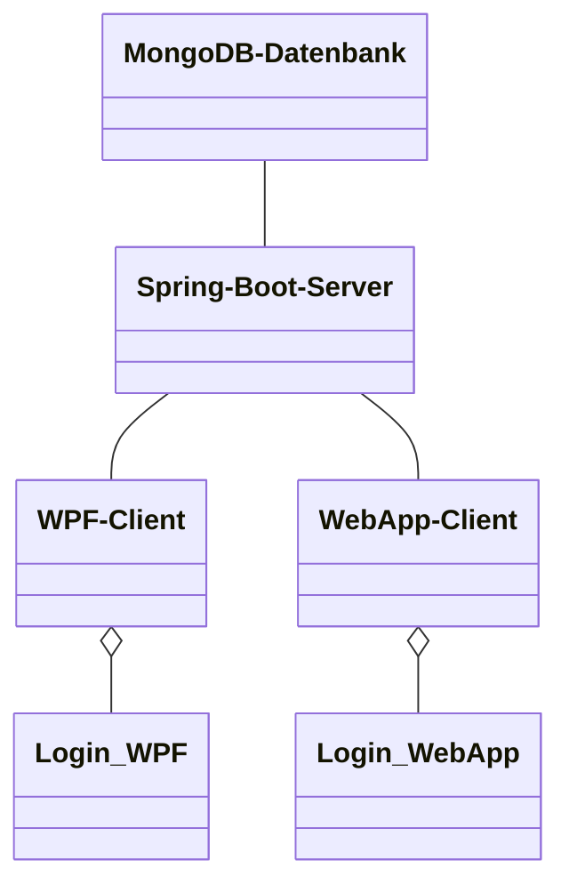

<br>

<details>
  <Summary>MongoDB-Datenbank</summary>

  **Beschreibung:** Wie die Daten eines Users in der  MongoDB-Datenbank gespeichert werden

  **Java-Endpoint:**
  ```json
    {
      "_id": {
        "$oid": "6641a7948e718f7024ff96b0"
      },
      "username": "test",
      "password": "G0ErqvuApy3nJmRBlxGYuxagJxPzUdwhCIcpb64v2+KZxAODXBX9LUynj1as/qDAnG2XZBUQqLCSD1romJX6agKlrDn1WhIyRe7tQc/mYq8=",
      "_class": "org.example.server_springboot.User"
    }
  ```
</details>

<details>
  <Summary>Spring-Boot Server</summary>

  **Beschreibung:** Login von dem Spring-Boot Server aus

  **Java-Endpoint:**
  ```java
    @PostMapping("/checkUser")
    public String checkUser(@RequestBody String body) {
        JSONObject jsonBody = new JSONObject(body);
        return chatService.checkUser(jsonBody.getString("username"), jsonBody.getString("password"));
    }
  ```

  **Java-Backend:**
  ```java
    //UserID aus MongoDB erhalten
    public String checkUser(String username, String password) {
        User user = userRepository.findUserByUsernameAndPassword(username, this.encrypt(password));
        if (user != null) {
            return user.getUserID();
        }
        return null;
    }
  ```
</details>

<details>
  <Summary>WPF-Client</summary>

  **Beschreibung:** Login von dem WPF-Client aus

  **C#-Code:**
  ```csharp
    //Benutzerdaten überprüfen
    async public Task<string?> Login(string name, string passwort)
    {
      try
      {
        //Username & Passwort an den Server schicken
        RestRequest request = new RestRequest("/checkUser", Method.Post);
        var body = new
        {
          username = name,
          password = this.Hash(passwort)
        };
        request.AddJsonBody(body);

        //Antwort (userID oder "" erhalten)
        RestResponse? response = await client.ExecuteAsync(request);
        return response.Content;
      }
      catch (Exception ex)
      {
        //MessageBox zum Anzeigen der Error-Message
        MessageBox.Show(ex.Message);
      }
      return null;
    }
  ```
</details>

<details>
  <Summary>WebApp-Client</summary>

  **Beschreibung:** Login von dem WebApp-Client aus

  **JS-Code:**
 ```js
    //Benutzerdaten überprüfen
    async function checkUserExistence(event) {
      try {
        event.preventDefault();
        //Benutzername & Passwort erhalten
        const username = document.getElementById("usernameLogin").value;
        const password = document.getElementById("passwordLogin").value;

        //Überprüfen, ob die Url zum Server in localStorage gesetzt wurde
        if (localStorage.getItem('urlToSpringBootServer') !== null && localStorage.getItem('urlToSpringBootServer') !== "") {
          //Überprpfen, ob Benutzername & Passwort richtig eingegeben wurde
          if (username !== null && username !== "" && password !== null && password !== "") {
            //Anfrage an den Server senden
            const response = await fetch(`${localStorage.getItem('urlToSpringBootServer')}/checkUser`, {
              method: 'POST', body: JSON.stringify({
              'username': username, 'password': await hash(password)
              })
            });

            //Login-Form leeren
            document.getElementById("usernameLogin").value = "";
            document.getElementById("passwordLogin").value = "";

            //Antwort erhalten
            const data = await response.text();
            //Wenn userID und nicht "" erhalten, dann weiter zu Home
            if (data !== null && data !== "") {
              localStorage.setItem('userID', data);
              localStorage.setItem('webAppStatus', "active");
              window.location.href = '../home/home.html' + localStorage.  getItem('urlParameter');
            } else {
              //Anzeigen, dass Anmeldedaten falsch waren
              alert("Anmeldung fehlgeschlagen");
            }
          } else {
            //Anzeigen, dass Benutzername und/oder Passwort nicht eingegeben wurde
            alert("Bitte geben Sie einen Benutzernamen und Passwort ein");
          }
        } else {
          //Anzeigen, dass der Server nicht erreicht werden aknn (weil die Url fehlt)
          alert("Server konnte nicht erreicht werden");
        }
      } catch (error) {
        //Error in Console loggen
       console.error(error);
      }
    }
  ```
</details>

## Diskussion der Ergebnisse
Nach ca. 2 Monaten und 3620 Zeilen Code in mehreren verschiedenen Programmier- & Scriptsprachen stelle ich die Erste Version meines ChatProgramms (tinyWhatsApp) vor. Das Chatprogramm hat eine intuative Benutzeroberfläche und eine Echtzeitkommunikation. Durch die Entwicklung der Clients in verschidenen Technologien (WPF & WebApp) ist die Unterstützung für sämtliche Platformen gegeben. Die Daten werden sicher in einer MongoDB-Datenbank gespeichert. Das Passwort wird im jeweiligen Client gehashed und im Server nochmals mit AES (= Advanced Encryption Service) verschlüsselt. Durch die Verschlüsselte Übertragung sind die Benutzerdaten von Fremdzugriffen gesichert.

### Zusammenfassung
tinyWhatsApp stellt eine intuitive Benutzeroberfläche für sämtliche Platformen zur Verfügung. Die REST-API des Spring-Boot Servers ermöglicht die Echtzeitkommunikation zwischen den Clients und der Datenbank.

### Hintergründe
Bei der Entwicklung der Chatprogramms wurde der Fokus auf Sicherheit der Benutzerdaten und Benutzerfreundlichkeit gelegt. Durch die Verwendung aktueller Technologien wie Spring-Boot, WPF, HTML, CSS, JSON & JavaScript wird die zukünftige Unterstützung gewährleistet. Die Nutzung einer MongoDB-Datenbank sorgt ebenfalls für die sichere Speicherung der Daten & effiziente Datenverwaltung.

### Ausblicke
In Zukunft soll das Chatprogramm auch Dateienübertragung (Foto, Video & Audio) unterstützen. Ebenfalls soll ein Benachrichtigungssystem implementiert werden. Durch Einbeziehen des Benutzerfeedbacks wird die Benutzerfreundlichkeit ebenfalls stark erhöht werden. TinyWhatsApp soll in Zukunft eine führende Plattform für sichere und benutzerfreundliche Echtzeitkommunikation werden.

## Diagramme

### Klassendiagramm des WPF-Clients
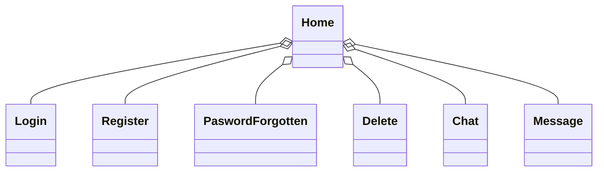

### Klassendiagramm des WebApp-Clients
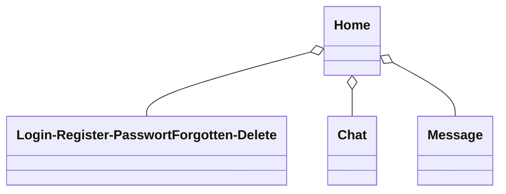

### Klassendiagramm des Spring-Boot Servers
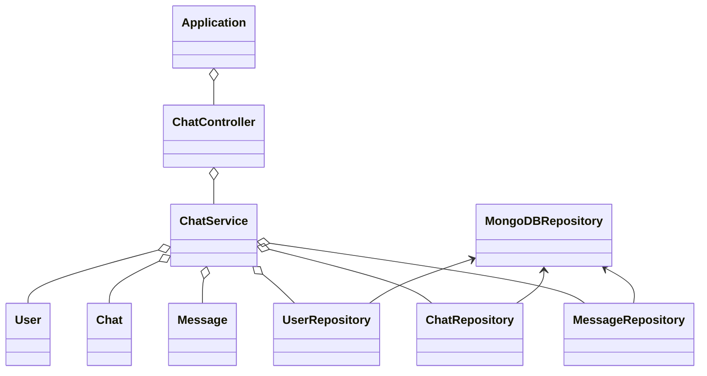

## Quellenverzeichnis

### Spring-Boot Server
#### [Spring-Boot]()
#### [JSON](https://www.json.org/json-en.html)

### WPF-Client
#### [C#](https://learn.microsoft.com/de-de/dotnet/csharp/)
#### [JSON](https://www.json.org/json-en.html)

### WebApp-Client
#### [HTML](https://developer.mozilla.org/en-US/docs/Web/HTML)
#### [CSS](https://developer.mozilla.org/en-US/docs/Web/CSS)
#### [JavaScript](https://developer.mozilla.org/en-US/docs/Web/JavaScript)
#### [JSON](https://www.json.org/json-en.html)

### MongoDB Datenbank
#### [MongoDB](https://www.mongodb.com/docs/)

### IDE & Nuggets
#### [WebStrom 2024.1.2](https://www.jetbrains.com/webstorm/download/download-thanks.html?platform=windows)
#### [IntelliJ IDEA 2024.1.1](https://www.jetbrains.com/idea/download/download-thanks.html?platform=windows)
   - ###### [Spring Boot Starter Data MongoDB 3.2.5](https://mvnrepository.com/artifact/org.springframework.boot/spring-boot-starter-data-mongodb/1.1.0.RELEASE)
   - ###### [Spring Boot Starter Web 3.2.5](https://mvnrepository.com/artifact/org.springframework.boot/spring-boot-starter-web)
#### [Visual Studio 2022 17.9.7](https://visualstudio.microsoft.com/de/thank-you-downloading-visual-studio/?sku=Community&channel=Release&version=VS2022&source=VSLandingPage&cid=2030&passive=false)
